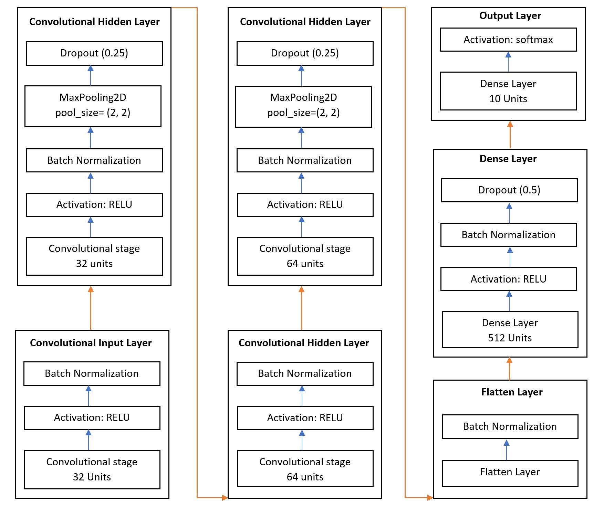
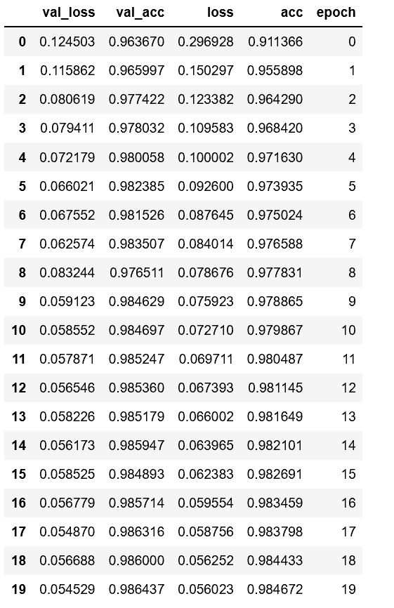
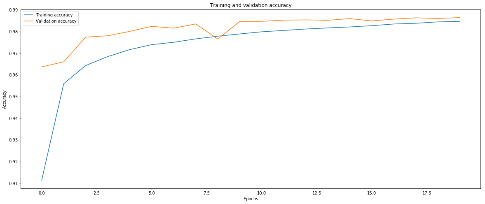
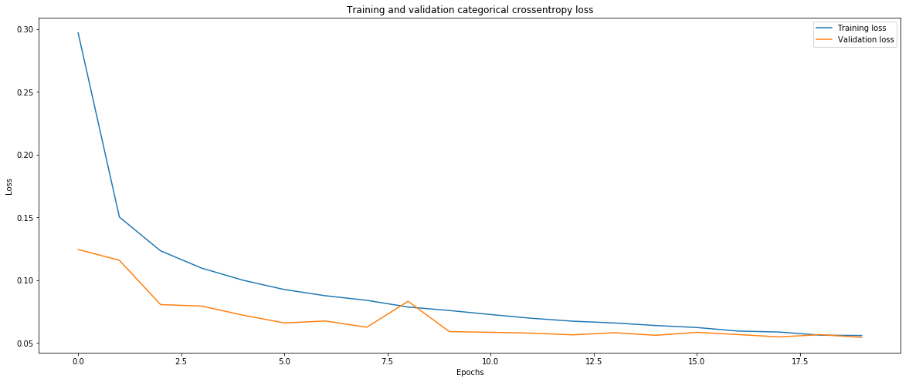
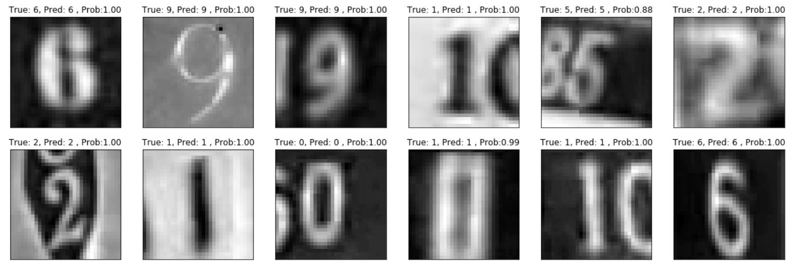
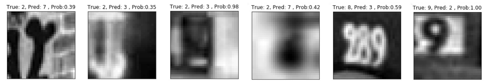

# CNN_SVHN

<h1>Training a Convolutional Neural Network (CNN) on the SVHN Dataset (Format 2) to classify house numbers</h1>

Description: Using Keras packages and Sequential interface to train a CNN model on the SVHN Dataset (Format 2) to classify house numbers.

### Architecture: ###

    CNN model to classify house numbers consists of following layers:

    1. First, convolutional input layer:
    Layer with 32 units, input shape (32, 32, 3) and RELU as an activation function. Batch 
    normalization to normalize first layer output data.

    2. Second, convolutional hidden layer:
    Layer with 32 units and RELU as an activation function. Applied batch normalization, 2D max 
    polling of (2,2) and dropout of 0.25 as additional layers.

    3. Third, convolutional hidden layer:
    Layer with 64 units and RELU as an activation function and applied batch normalization.

    4. Fourth, convolutional hidden layer:
    Layer with 64 units and RELU as an activation function. Applied batch normalization, 2D max 
    polling of (2,2) and dropout of 0.25 as additional layers.

    5. Flatten Layer:
    Added flatten layer with batch normalization to transform data before feeding to dense layer

    6. First Dense Layer:
    Added dense layer with 512 units and RELU as an activation function. Applied batch  
    normalization and dropout of 0.5 as additional layers.

    7. Second Dense Layer (Output Layer):
    Added output layer as a dense layer with 10 units and softmax as an activation function to 
    predict house number.

## Solution Steps: ##

### List of packages ###

    import os
    import itertools
    import numpy as np
    import scipy.io
    import pandas as pd
    import seaborn as sns

    import keras
    from keras.models import Sequential
    from keras.utils import np_utils
    from keras.layers import Dense, Dropout, Activation, BatchNormalization,Flatten,Conv2D
    from keras.layers.convolutional import Convolution2D, MaxPooling2D
    from keras.optimizers import SGD, Adadelta, Adagrad

    from sklearn import datasets
    from sklearn.model_selection import train_test_split
    from sklearn.model_selection import GridSearchCV
    from keras.callbacks import EarlyStopping
    import matplotlib.pyplot as plt

    %matplotlib inline
    plt.rcParams['figure.figsize'] = (12.0, 8.0)

### Load Street View House Numbers (SVHN) Dataset (Format 2) ###

Download all three SVHN Dataset (Format 2) files from (http://ufldl.stanford.edu/housenumbers/) source

    train_dataset = scipy.io.loadmat('train_32x32.mat') 
    train_extra_dataset = scipy.io.loadmat('extra_32x32.mat')
    test_dataset = scipy.io.loadmat('test_32x32.mat')

### Preprocessing steps ###

    # Separate actual image data and label
    X_train = train_dataset['X']
    y_train = train_dataset['y']
    X_extra_train = train_extra_dataset['X']
    y_extra_train = train_extra_dataset['y']
    X_test = Test['X']
    y_test = Test['y']

    # Print shape of the dataset
    print('Training set: ', X_train.shape, y_train.shape)
    print('Training extra set: ', X_extra_train.shape, X_extra_train.shape)
    print('Testing set: ', X_test.shape, y_test.shape)

    # Encode target column
    X_train = X_train.astype('float32')
    X_extra_train = X_extra_train.astype('float32')
    X_test = X_test.astype('float32')

    # Scale data instance values between 0 to 1, before feeding to the neural network model
    X_train /= 255
    X_extra_train /= 255
    X_test /= 255

    X_train = X_train[np.newaxis,...]
    X_train = np.swapaxes(X_train,0,4).squeeze()

    X_extra_train = X_extra_train[np.newaxis,...]
    X_extra_train = np.swapaxes(X_extra_train,0,4).squeeze()

    X_test = X_test[np.newaxis,...]
    X_test = np.swapaxes(X_test,0,4).squeeze()

    np.place(y_train,y_train == 10,0)
    np.place(y_extra_train,y_extra_train == 10,0)
    np.place(y_test,y_test == 10,0)

    y_train = keras.utils.to_categorical(y_train, 10)
    y_extra_train = keras.utils.to_categorical(y_extra_train, 10)
    y_test = keras.utils.to_categorical(y_test, 10)

### Model settings ###

    batch_size = 128
    nb_classes = 10
    nb_epoch = 20

### Create sequential model object ###
    
    # create Sequential model object
    model = Sequential()

    <h3>Model architecture setting</h3>

    #input layer with 32 nodes
    model.add(Conv2D(32,(3, 3), border_mode='same',activation='relu',input_shape=(32, 32, 3))) 
    model.add(BatchNormalization())

    # first hidden layer with 32 nodes
    model.add(Conv2D(32,(3, 3),activation='relu'))
    model.add(BatchNormalization())
    model.add(MaxPooling2D(pool_size=(2, 2)))
    model.add(Dropout(0.25))

    # second hidden layer with 64 nodes
    model.add(Conv2D(64,(3, 3), border_mode='same',activation='relu'))
    model.add(BatchNormalization())

    # third hidden layer with 64 nodes
    model.add(Conv2D(64,(3, 3),activation='relu')) 
    model.add(BatchNormalization())
    model.add(MaxPooling2D(pool_size=(2, 2)))
    model.add(Dropout(0.25))

    # Flatten layer, Flatten serves as a connection between the convolution and dense layers
    # transforms the format of the images from a 2d-array to a 1d-array
    model.add(Flatten())
    model.add(BatchNormalization())

    # Dense is the layer to perform classification
    model.add(Dense(512,activation='relu'))
    model.add(BatchNormalization())
    model.add(Dropout(0.5))

    # Final Dense layer to map target class
    model.add(Dense(nb_classes,activation='softmax'))

    # steps to compile model, using SGD as learning rate
    sgd = SGD(lr=0.01, decay=1e-6, momentum=0.9, nesterov=True)
    model.compile(
        loss='categorical_crossentropy', 
        optimizer=sgd,
        metrics=['accuracy']
    )

    # model summary
    model.summary()

### Model training ###

    # fit model
    model_history = model.fit(X_extra_train, y_extra_train, batch_size=batch_size, nb_epoch=nb_epoch, verbose=1,
              shuffle=True,validation_split=0.25,
              callbacks=[EarlyStopping(monitor='val_loss', patience=5)])
          
### Performance matrix on Training and Validation dataset ###

    # Performance matrix 

    hist = pd.DataFrame(model_history.history)
    hist['epoch'] = model_history.epoch
    hist
    

 
<h3>Graph: Training and Validation dataset performance</h3>

#### Training and validation datasets accuracy ####

#### Training and validation datasets crossentropy loss ####
 

 

### Evaluate model performance on Test dataset ###

    #Evaluate model performance on Test dataset
    test_loss, test_accuracy= model.evaluate(X_test, y_test)
    print('Test Loss:', test_loss)
    print('Test Accuracy:',test_accuracy)
    
    *****************************************************
    Test Dataset Crossentropy Loss: 0.1548489878761162
    Test Dataset Accuracy: 0.9638137676705593
    *****************************************************

### Make predictions on Test Dataset ###

    prediction_array = model.predict(X_test)
    predicted_class = np.argmax(prediction_array, axis=1)
    
### Graph: Plot the first X test images, their predicted label, and the true label ###

    # Plot function 
    def plot_predicted_label(images, nrows, ncols, cls_true, cls_pred,prediction_array):
        fig, axes = plt.subplots(nrows, ncols,figsize=(20, 10))

        rs = np.random.choice(images.shape[0], nrows*ncols)

        for i, ax in zip(rs, axes.flat):
            prob = round(prediction_array[i][cls_pred[i]],2)
            title = 'True: %s, Pred: %s , Prob:%0.2f' % (np.argmax(cls_true[i]),cls_pred[i],prob)
            ax.imshow(images[i,:,:,0], cmap='binary')
            ax.set_title(title)

            ax.set_xticks([])
            ax.set_yticks([])

    # ploat image with predicted and actual value
    num_rows = 3
    num_cols = 6
    plot_predicted_label(X_test,num_rows, num_cols, y_test,predicted_class,prediction_array);

#### Correctly predicted labels ####

#### Wrongly predicted labels ####

### Save entire model to a HDF5 file ###

    # Save entire model to a HDF5 file
    model.save('ML_Assin4_CNN_Model.h5')

## Dataset Source ##
http://ufldl.stanford.edu/housenumbers/

## Files ##
<li>cnn_svhn.ipynb includes codes to load SVHN dataset, train models, draw accuracy and loss graphs and predict label of test dataset.</li>

#### References ####
    https://www.tensorflow.org/tutorials/keras
    https://github.com/thePetrMarek/SequenceOfDigitsRecognition
    https://towardsdatascience.com/building-a-convolutional-neural-network-cnn-in-keras-329fbbadc5f5
    https://ekababisong.org/gcp-ml-seminar/tensorflow/
    https://github.com/auygur/CNN-SVHN_Keras

